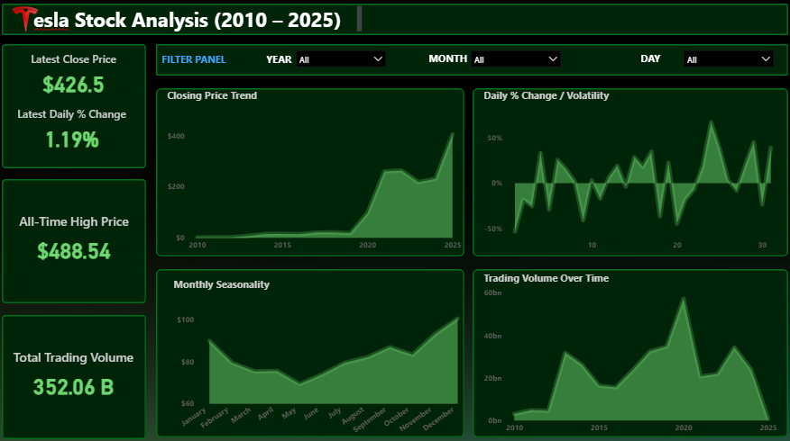

# Stock Price Analysis Dashboard – Power BI

## 📌 Overview
A simple Power BI project analyzing **daily stock performance** using Open, Close, High, Low, and Volume data.  
The dashboard highlights **price trends, volatility, and daily movement** with interactive slicers for **Year, Month, and Day**.

## 📊 Dashboard

## 🚀 Features
- **Dynamic line chart** with green (positive) and red (negative) points  
- **Volatility analysis** based on daily price fluctuations  
- **Interactive slicers** – Year, Month, Day  
- **Clean UI for quick insights**

## 📁 Dataset
The dataset includes:
- Date  
- Open  
- Close  
- High  
- Low  
- Volume  

## 🛠 Tools Used
- **Power BI Desktop**
- **Excel / CSV dataset**

## 📄 How to Use
1. Open the `.pbix` file in Power BI  
2. Load your stock dataset  
3. Refresh visuals and interact with slicers  

## 👍 Author
Created by **Shabeeb**  
